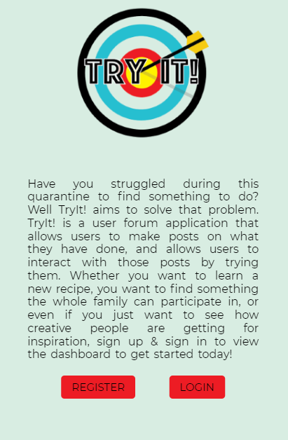
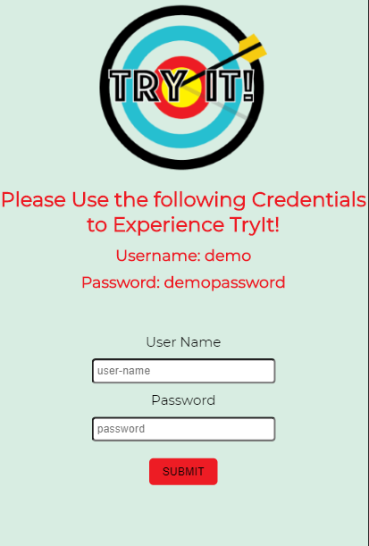
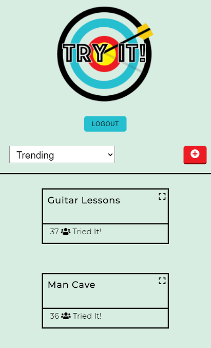

# TryIt!

> A Full Stack Forum-based Application that encourages user's to try new things!

## Live App Link

- Client deployed on Zeit
- Server deployed on Heroku

## App Images

  
  
  
  
  
  

## Summary

TryIt! is a full stack forum application that encourages users to try something new, or help others find something to do! The user can filter posts by specific tags, which are selected by the user upon creation of a post. If a post catches your eye, expand the post to view more details and let the user know if you tried it!

## Technology Stack

### Front End

- HTML5
- CSS
- JavaScript
- React

### Back End

- Node.js
- Express
- Mocha
- Chai
- PostgreSQL

### Development Environment

- Git
- Github
- Postman
- Visual Studio Code

## API Documentation

### API Endpoints

- GET to '/api/cards' retrieves all posts from the database
- GET to '/api/cards?id=1' retrieves a specific post from the database
- POST to '/api/cards' makes a new post to the database
- PATCH to '/api/cards' updates the tries on a specific post
- DELETE to '/api/cards' deletes a post made by the user
- GET to '/api/tags' retrieves all possible tags from the database
- POST '/user/register' posts a new user to the database
- POST '/user/login' authenticates and login a returning user

## Contributors

This application was built by [Tony Milone](https://github.com/tomilone)
